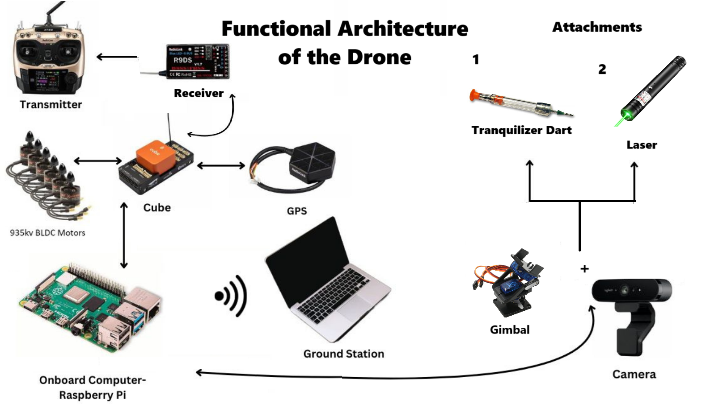
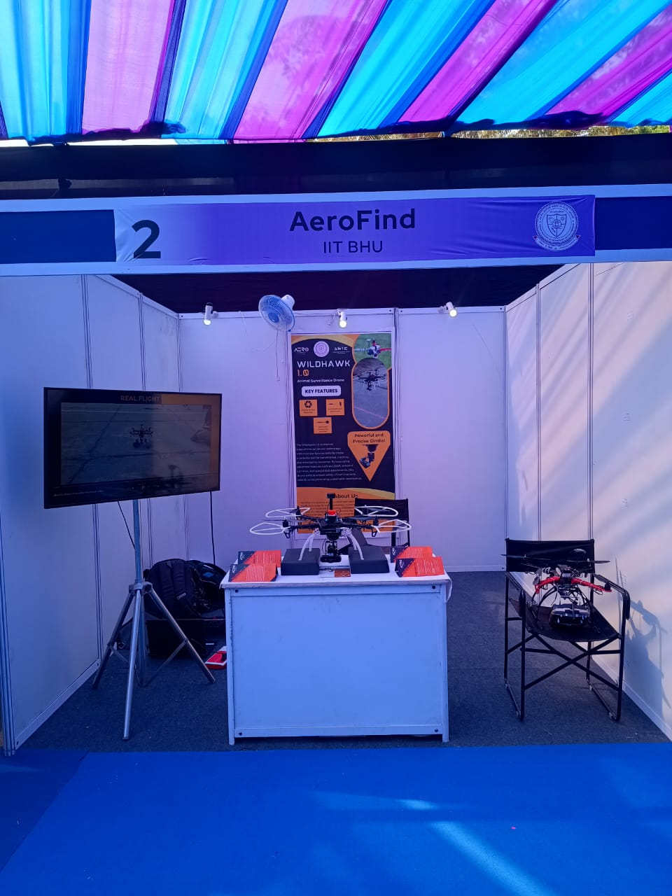

# 🦅 WildHawk 1.0 — Animal Surveillance Drone

**WildHawk 1.0** is an **autonomous wildlife surveillance and deterrence drone** designed to monitor animal movements near residential or agricultural zones and safely guide them back to their natural habitat.  

Developed between **October 2024 – December 2024**, this system combines **edge AI vision**, **autonomous navigation**, and **ROS 2-based mission coordination** to deliver real-time animal tracking and behavioral analysis in the field.

---

## 🧠 System Overview

```text
           ┌────────────────────────────────────┐
           │       Onboard Raspberry Pi         │
           │ • TensorFlow Lite + MobileNet V2   │
           │ • Animal Detection & Classification│
           │ • ROS 2 Nodes for Mission Control  │
           └──────────────────┬─────────────────┘
                              │
                              │ DDS (ROS 2 Communication)
                              ▼
           ┌────────────────────────────────────┐
           │        PX4 Autopilot (Pixhawk)     │
           │ • Flight Control & Stabilization   │
           │ • Telemetry via MAVLink            │
           └──────────────────┬─────────────────┘
                              │
                              │ MAVLink + ROS 2 Bridge
                              ▼
           ┌────────────────────────────────────┐
           │     Ground Station (QGroundControl)│
           │ • Live Video & Telemetry Feed      │
           │ • Mission Monitoring Interface     │
           └────────────────────────────────────┘
````

---

## 🖼️ Project Media

|               Drone Prototype              |             System Architecture            |                InterIIT Expo               |
| :----------------------------------------: | :--------------------------------------------: | :------------------------------------------: |
|  |  |  |

Additional visual assets are included in the `media/` folder:

```
media/
├─ images/      # Photos and frame captures
├─ videos/      # DART animation, demo flight videos
├─ posters/     # Project poster and banner
```

---

## 🎥 Featured Video

🎬 [Watch WildHawk 1.0 Project Videos](https://drive.google.com/drive/folders/1DCHJ-amFsBTfoMgyBtMUPhNHdaVNea2l?usp=sharing)

---

## ⚙️ Hardware & Software Setup

### 🧩 Hardware Components

* **Pixhawk Cube Orange+** — running **PX4 Autopilot**
* **Raspberry Pi 4 B (8 GB)** — companion computer for onboard AI
* **Camera Module** — CSI/USB camera for real-time video
* **Telemetry** — Wi-Fi or 915 MHz radio link to Ground Station
* **Battery** — 4S Li-Po (5200 mAh) with 20–25 min endurance

---

## 🧰 Software Stack

| Component                          | Purpose                                    |
| ---------------------------------- | ------------------------------------------ |
| **PX4 Autopilot**                  | Flight control firmware                    |
| **ROS 2 Humble**                   | Middleware for inter-process communication |
| **TensorFlow Lite + MobileNet V2** | Real-time object detection on edge         |
| **OpenCV**                         | Frame preprocessing and tracking           |
| **QGroundControl (QGC)**           | Mission planning and telemetry monitoring  |
| **DDS (Fast RTPS)**                | Low-latency message exchange between nodes |

---

## 🧩 Installation & Setup

### 1️⃣ PX4 Autopilot

Follow PX4 installation:

```bash
git clone https://github.com/PX4/PX4-Autopilot.git
cd PX4-Autopilot
make px4_sitl gazebo
```

### 2️⃣ ROS 2 Environment

Install ROS 2 Humble:

```bash
sudo apt install ros-humble-desktop
source /opt/ros/humble/setup.bash
```

Create workspace:

```bash
mkdir -p ~/wildhawk_ws/src
cd ~/wildhawk_ws/
colcon build
source install/setup.bash
```

### 3️⃣ Python Dependencies

```bash
pip install tensorflow-lite opencv-python numpy pyserial
```

### 4️⃣ Launch Order

1. **Start PX4 SITL** or connect real Pixhawk
2. **Start ROS 2 Nodes:**

   ```bash
   python3 mission.py
   ```
3. **Open QGroundControl** for live visualization
4. Observe autonomous detection → response → deterrence cycles

---

## 📁 Project Structure

```
WildHawk_1.0/
├─ src/
│  ├─ detection_node.py          # Animal detection using TFLite
│  ├─ tracker_node.py            # Behavior tracking logic
│  ├─ px4_bridge_node.py         # MAVLink–ROS 2 communication
│  └─ mission_coordinator.py     # Mission management
├─ media/
│  ├─ images/
│  ├─ videos/
│  └─ posters/
├─ launch/
│  └─ detection_and_nav.launch.py
└─ README.md
```

---

## 🏆 Achievements

🏅 **This project was showcased at InterIIT Tech Meet 13.0**

* Presented under the **Autonomous Systems and AI for Wildlife Conservation** track.
* Demonstrated **edge inference, real-time tracking, and autonomous deterrence** using ROS 2.
* Received appreciation for **low-latency control and animal-friendly intervention design**.

---

## 👩‍💻 Developers

**Project Lead:** Shaneshraje Kadu\
**Institute:** IIT (BHU), Varanasi\
**Club:** Aero-Modelling Club, IIT (BHU)

---

## 📜 License

This project is released under the **MIT License**.
Use, modify, and distribute with proper attribution.

---

## 📬 Contact

📧 *[[shaneshraje@gmail.com](mailto:shaneshraje@gmail.com)]*
🌐 GitHub: [@ShaneshrajeK](https://github.com/ShaneshrajeK)

---

> 🦅 *“Guarding the wild with intelligence — WildHawk 1.0.”*
